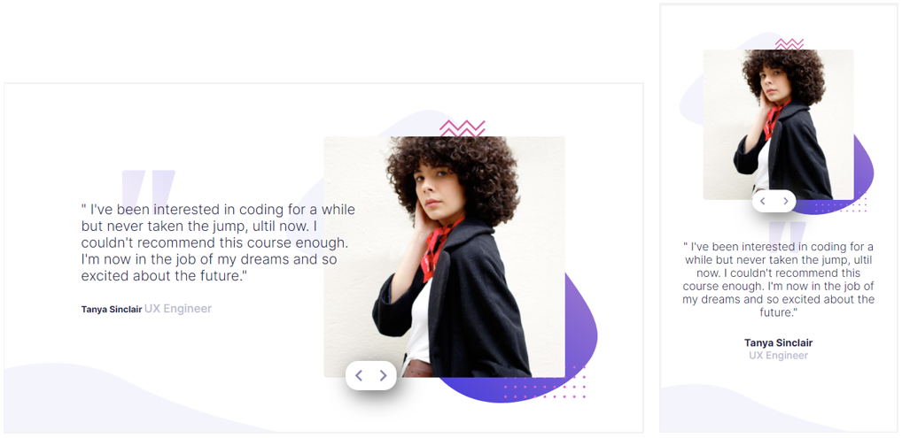

# Frontend Mentor - Coding bootcamp testimonials slider

Desafio Frontend Mentor  - Coding bootcamp testimonials slider - criar uma página responsiva o mais próxima possível do layout apresentado e utilizar JavaScript para criar o Slider

 </img>

## Acesse a página ✔️

https://pablohpaiva22.github.io/testimonials-slider/

## Welcome! 👋

Thanks for checking out this front-end coding challenge.

[Frontend Mentor](https://www.frontendmentor.io) challenges help you improve your coding skills by building realistic projects.

**To do this challenge, you need a basic understanding of HTML, CSS and JavaScript.**

## The challenge

Your challenge is to build out this testimonial slider and get it looking as close to the design as possible.

You can use any tools you like to help you complete the challenge. So if you've got something you'd like to practice, feel free to give it a go.

Your users should be able to: 

- View the optimal layout for the component depending on their device's screen size
- Navigate the slider using either their mouse/trackpad or keyboard

Want some support on the challenge? [Join our Slack community](https://www.frontendmentor.io/slack) and ask questions in the **#help** channel.
